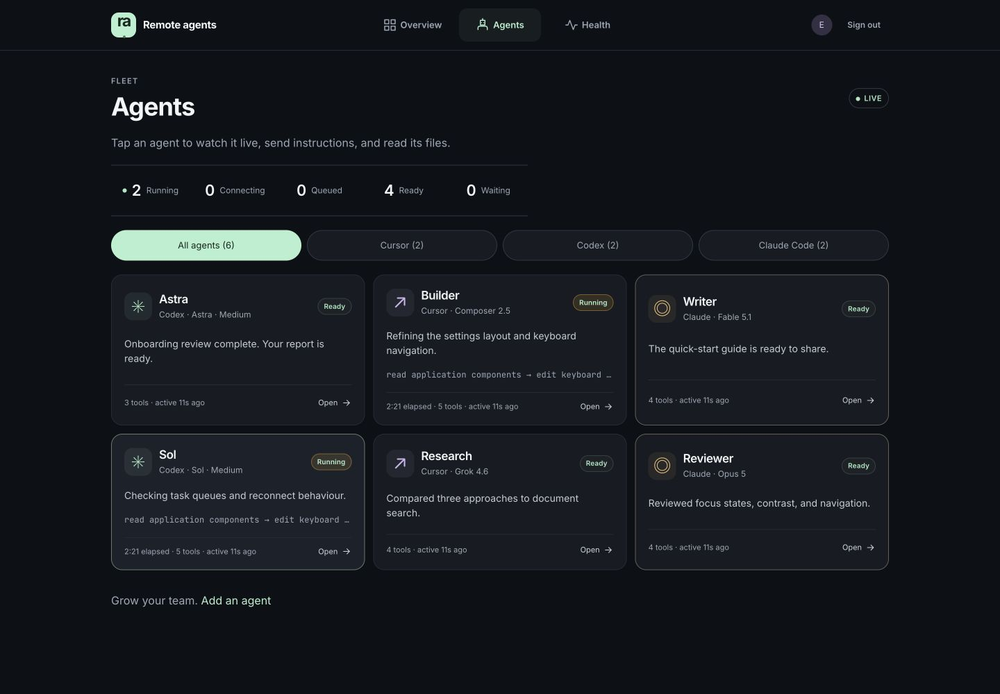
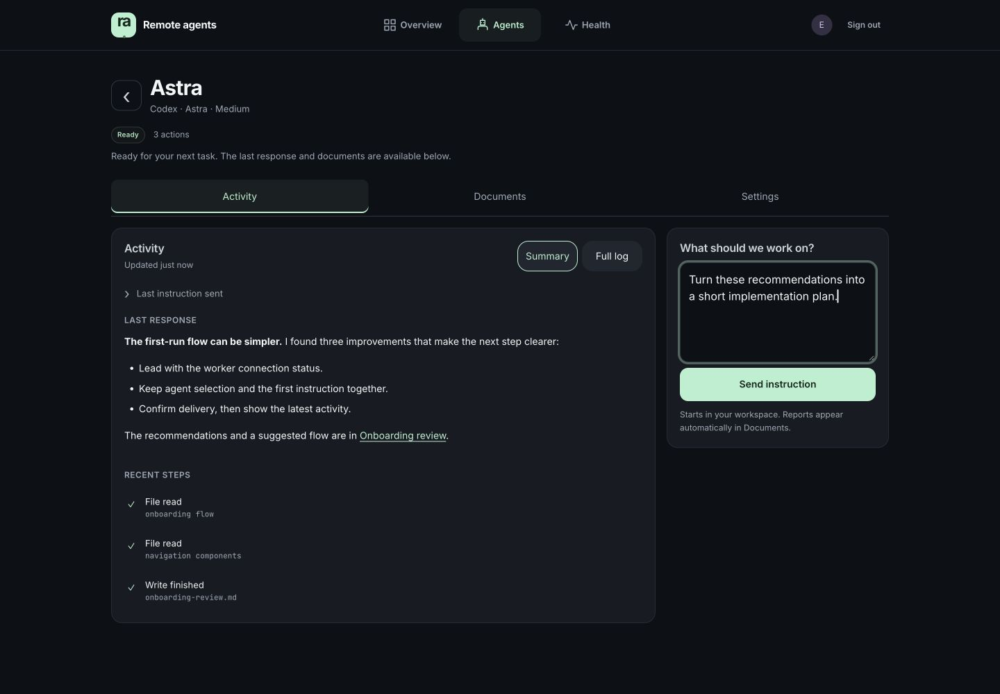
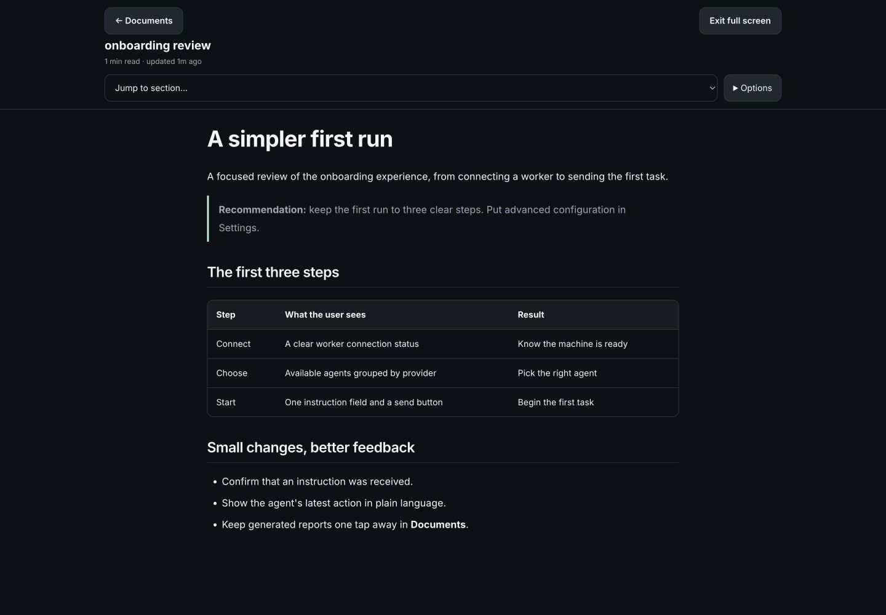

# Remote Agents

Run **Cursor, Codex, and Claude Code** on your own machine. Access your agents from anywhere, follow their progress, manage tasks, and share reports through a mobile-first interface.

## What you can do

- Run multiple agents, each with its own conversation, model, workspace, and task queue.
- Send instructions, stop a task, or remove queued work.
- Follow readable activity summaries or inspect the full execution log.
- Find automatically collected reports in **Documents**, then read, copy, or share links to them.
- Read Markdown on mobile with section navigation, a focused reader, and scrollable code and tables.
- Configure your fleet and check provider and connection health in one place.

## How it works

A worker on your computer runs the agents and connects outbound to your Linux control server over WSS. You use the web app over HTTPS to send tasks, receive updates, and read documents. The control server relays commands; the agents execute on the worker machine.

**Agents have full access to files available to the worker user, with approval prompts disabled.** Give access only to trusted operators. OS permissions still apply. See [SECURITY.md](SECURITY.md).

## Default fleet

**The default setup is customizable.** Choose your agents, providers, supported models, names, and working directories in a fleet JSON file. Set `AGENT_FLEET_FILE` in the worker’s private environment file and restart the worker. Start with [examples/fleet.defaults.json](examples/fleet.defaults.json); see [AGENTS.md](AGENTS.md) for the schema and persistence rules.

Without an override, the worker starts these eleven agents:

| Provider | Agents |
| --- | --- |
| Cursor | Agent 1 and Agent 2 (Grok 4.6), Agent 3 and Research (Composer 2.5) |
| Codex | Astra 1 and Astra 2 (GPT-6 Astra, Medium), Sol (GPT-5.6 Sol, Medium) |
| Claude Code | Fable 5.1, Fable 5, Opus 5, Opus 4.8 |

Each provider requires its own authentication and model access. All eleven slots remain visible if a provider is unavailable, with an explanation of the problem. Conversations and model selections survive restarts.

A custom fleet replaces the built-in roster. Saved model selections take precedence over `defaultModel` for existing slots. You can also add agents in the app; with a custom fleet, include their definitions in the file to keep them in the roster after a restart.

## Get started

Set up **two parts from this repository**, in this order:

| Where | Install and run | Setup instructions |
| --- | --- | --- |
| **Your remote Linux server** | Web interface, authentication, API, and connection relay, with nginx/HTTPS and a systemd service | [1. Set up the server](docs/setup.md#control-server-linux) |
| **Your local computer** | Worker plus authenticated Cursor, Codex, and Claude Code CLIs. Agents work on your projects here. Supports macOS, Linux, or Windows through WSL2 Ubuntu. | [2. Set up the local worker](docs/setup.md#worker-setup) |
| **Your phone or browser** | Open your server's HTTPS address and sign in. | No installation needed |

Use the same repository revision on both machines. The setup guide provides separate commands and environment settings for each. The server and worker share a private `WORKER_TOKEN`; provider credentials and project paths belong on the local worker. Keep the local computer awake and connected while agents run.

Both installation paths use **Node.js 22.13+**, **npm 10.9.2**, and **Python 3**. See [`.env.example`](.env.example) for application settings and [config/](config/README.md) for provider templates. Keep machine-specific paths, service URLs, and credentials in private environment files.

## Development

See [CONTRIBUTING.md](CONTRIBUTING.md) for local setup and validation. `npm test` covers unit, security, and server/worker integration checks. Live provider checks are available in [scripts/validate-live.cjs](scripts/validate-live.cjs).

| Directory | Purpose |
| --- | --- |
| `apps/web` | React interface |
| `apps/server` | Authentication, API, and WebSocket relay |
| `apps/worker` | Provider runtimes, task queues, and reports |
| `packages/shared` | Models, protocol, and shared helpers |
| `config`, `examples` | Provider templates and fleet configuration |
| `scripts`, `deploy` | Setup, validation, and service configuration |

## A look inside

An example workspace with a custom six-agent fleet and sample tasks.

Explore the agent workspace and report reader

**Follow the work and send the next instruction.** Read the response, inspect recent steps, and keep the task moving from one screen.

**Read and share the result.** Open reports in a focused reader with section navigation, formatted tables, and copy options.

## License

[MIT](LICENSE). Provider accounts and third-party dependencies have their own terms and licenses.
